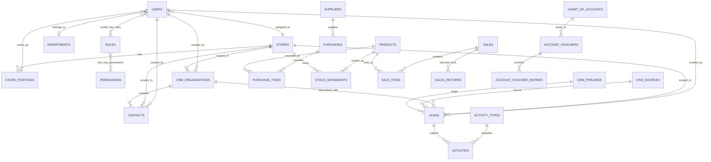

# ERP/CRM implementation plan

## Architecture rule

`Config` is the absolute dependency for every business record. A request is handled only after its authenticated user has an active role, belongs to an active store (where the module is store-scoped), and owns the required permission. New operational records should persist `created_by` and `store_id` as applicable.

## Authoritative module sequence

All implementation, migrations, permissions, navigation, APIs, and test cases must follow this dependency order:

1. Config — User Role → Employee → New User/User → Store → Store Position
2. System Settings — Lead Source, Lead Pipeline Stages, Department, Products, Activity Type, Showroom/Warehouse and supporting master values
3. Customer Relationship — Contact Add/Contact → Organization → Lead Add/Leads → Activity Add
4. Item Inventory — Item Category → Item → Supplier
5. Stock & Inventory — Product Transfer → Product Receive → Stock Summary
6. Dealer & Delivery — Add New Dealer → Dealer List → Delivery Order List → Delivery Challan
7. Order & Sales — Sales Target → Customer Sale Entry → Sales Collection → Sale Return
8. Promotion & Campaign — Budgets → Events → Bulk SMS Blast
9. Meeting & Planning — Pre-event Plans → Agenda List → Meetings
10. Accounts — Chart of Accounts → Receive/Payment Entry → Journal Vouchers
11. Financial Reports — Cash Book → Bank Book → Ledgers → Trial Balance → Income Statement → Balance Sheet

## Current implementation match

| Phase | Module | Current implementation | Next build target |
| --- | --- | --- | --- |
| 1 | Config | Implemented: roles, users/employees, stores, store positions, departments | add user-facing audit/history and store-scope policies |
| 1 | System Settings | Implemented: lead sources, pipeline stages, departments, products, activity types, stores | add the remaining menu masters: event types, landmarks, notification types, PDI/QC items, email settings, backups |
| 1 | Customer Relationship | Implemented: contacts, organizations, leads, activities | add edits/detail timelines and store-level filtering |
| 1 | Item Inventory | Products and suppliers exist; categories are currently a product enum | normalize item categories if non-pharmacy items are required |
| 2 | Stock & Inventory | Purchase/product receive and stock summary exist | add inter-store product transfers with approval and movement ledger |
| 2 | Dealer & Delivery | Dealer sales, collections, cheques and documents exist | add new-dealer master, delivery order and challan lifecycle |
| 3 | Order & Sales | Targets, customer/dealer sale, collections, returns and adjustments exist | connect all sale documents to store/creator scope |
| 3 | Promotion & Campaign | SMS, budgets and events exist | add campaign performance and consent/audience rules |
| 3 | Meeting & Planning | Agendas, pre-event plans and meetings exist | add attendees, decisions and action-item follow-up |
| 4 | Accounts | Chart of accounts, receive/payment and journal vouchers exist | enforce operational posting rules and approval controls |
| 4 | Financial Reports | Ledger, trial balance, income statement and balance sheet exist | add cash book, bank book, store/date filtering and exports |

## Core ERD

## RBAC design

Permissions are seed-owned strings grouped by module and assigned through the Role screen. The `admin` role bypasses evolving permissions, but ordinary roles must have each required permission.

| Permission group | Examples | Scope |
| --- | --- | --- |
| `config.*` | `config.roles.manage`, `config.employees.manage`, `config.stores.manage` | identity and store setup |
| `system-settings.*` | `system-settings.manage` | dropdown/master settings |
| CRM | `contacts.manage`, `organizations.manage`, `leads.manage`, `activities.manage` | customer data and activities |
| Inventory | `products.manage`, `purchases.manage`, `stock.adjust` | item and stock movement |
| Sales | `pos.access`, `sales.manage`, `sales.return` | sales operation |
| Financial | `accounts.manage`, `reports.view` | postings and reporting |

Recommended enforcement for a store-scoped endpoint:

1. Authenticate with Sanctum session/token.
2. Confirm `users.is_active` and an assigned active store.
3. Run the permission middleware.
4. Apply `where('store_id', $request->user()->store_id)` for list/read/update operations, unless the role has an explicit all-stores permission.
5. Set `created_by` and `store_id` server-side; never trust these values from a browser/mobile request.

## API integration sequence

1. **Authentication** — `POST /api/v1/login`; return token, user, roles, permissions, store and store position.
2. **Bootstrap** — expose `GET /api/v1/bootstrap` with active store-scoped lookup data: settings, departments, activity types, products and permitted menu capabilities.
3. **Master data** — use versioned CRUD endpoints such as `/api/v1/settings/lead-sources`, `/pipeline-stages`, `/departments`, `/stores` and `/store-positions`; every write checks its Config permission.
4. **CRM** — `GET/POST /api/v1/contacts`, `/organizations`, `/leads`, `/activities`; set audit columns in controllers/services and return paginated resources.
5. **Inventory** — `POST /product-receipts`, `/stock-transfers`; commit document, line items and `stock_movements` in one database transaction.
6. **Sales** — `POST /sales`, `/collections`, `/returns`; validate stock and create accounting postings atomically.
7. **Reporting** — read-only endpoints under `/api/v1/reports/*`, accepting `store_id` only for users with all-stores access.

## Build gate for every phase

For each module: migration and foreign keys → model/policy → permission seed → controller/request validation → browser/API routes → store-scoped queries → feature tests → seed/demo data → user acceptance test.
